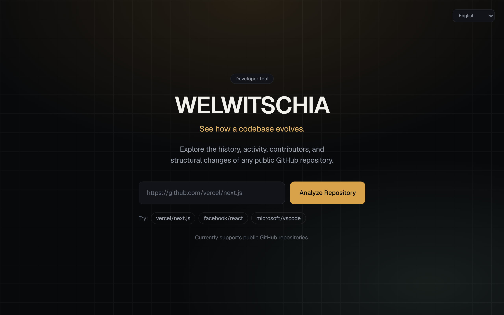
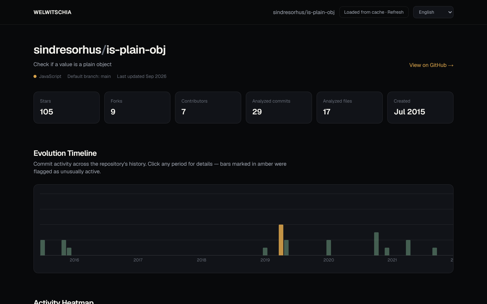
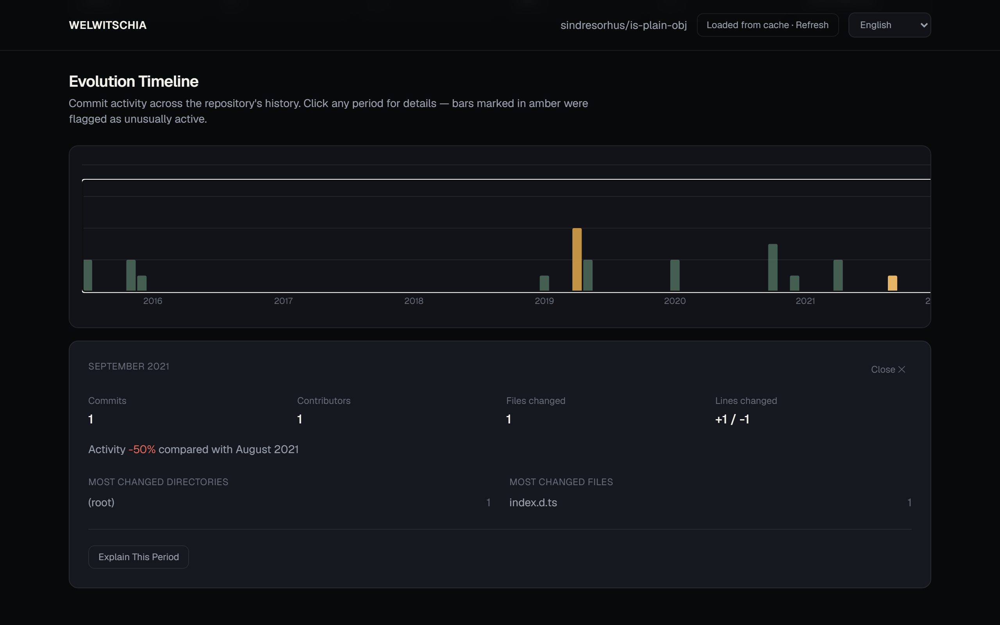
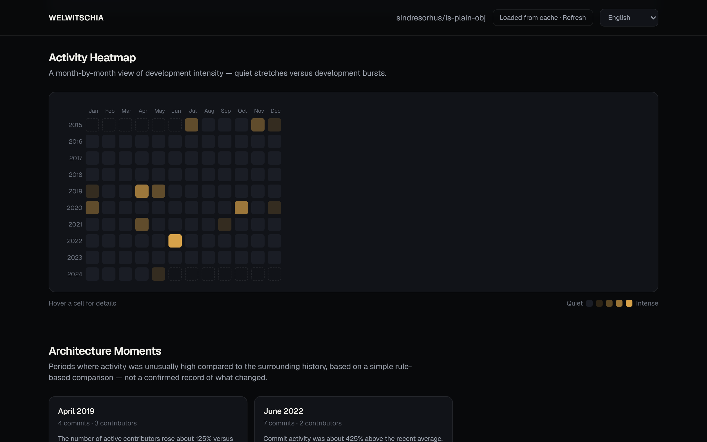
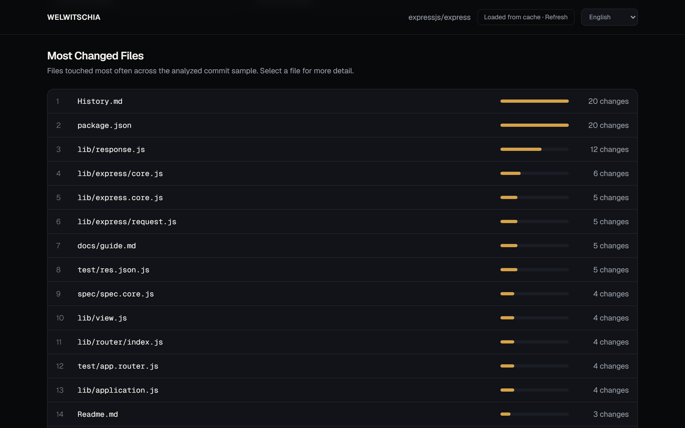
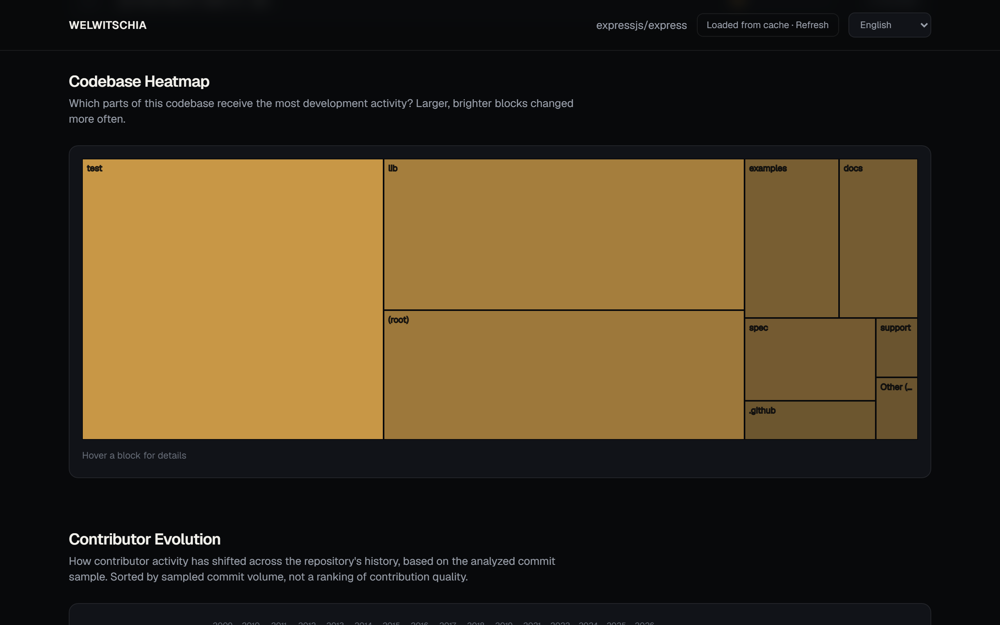
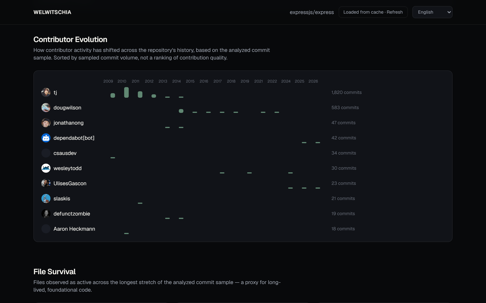
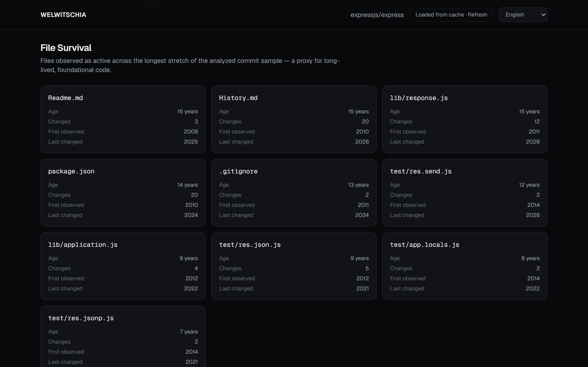
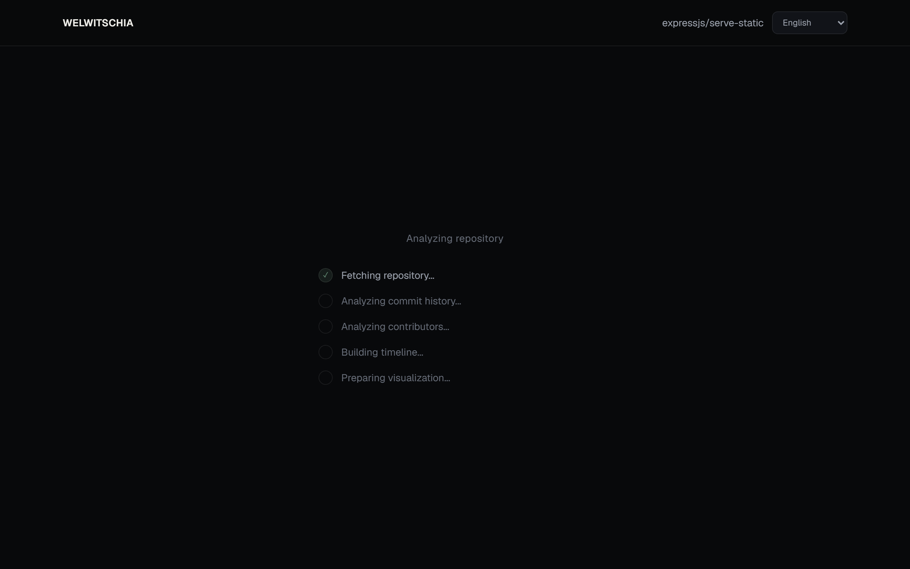
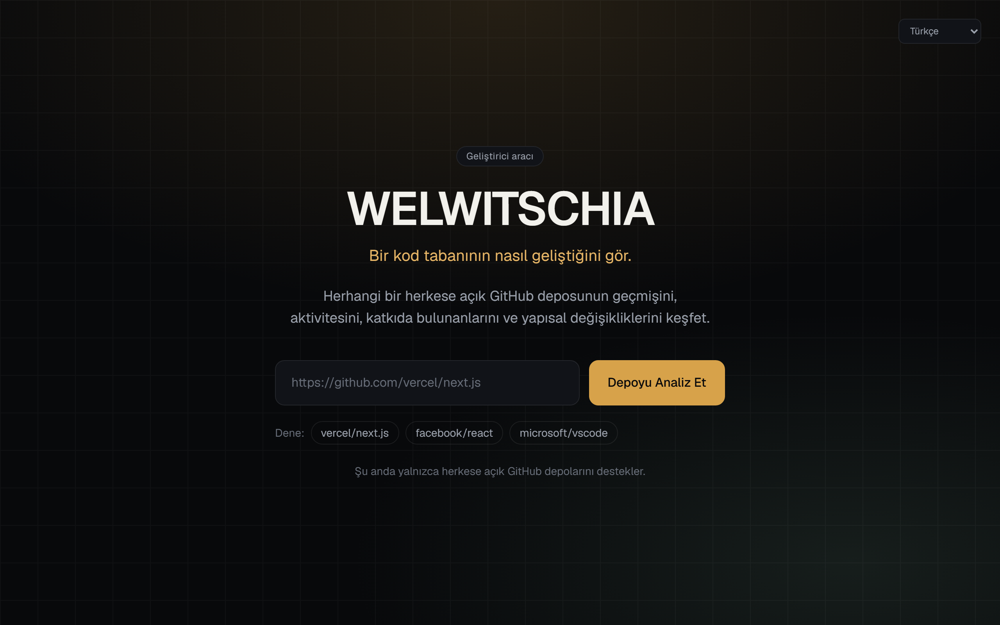

# Welwitschia

**See how a codebase evolves.**

Coded by [Alperen Yavuz](https://github.com/alplix).

Welwitschia is a developer tool that visualizes how a public GitHub repository has evolved over time — its commit activity, most-changed files, contributor patterns, and structurally active areas of the codebase.



## What is Welwitschia?

Point Welwitschia at any public GitHub repository (e.g. `https://github.com/vercel/next.js`) and it analyzes the repository's commit history to build an interactive picture of its development story: when it was most active, which files and directories have seen the most churn, who has contributed and when, and which periods stand out as unusually active.

It is not a clone of GitHub's own repository statistics. It's a focused, visual way to *explore* a repository's history rather than a raw stats dashboard.

## Screenshots

**Repository overview and evolution timeline** — stars, forks, contributors, and an interactive month-by-month commit chart. Amber bars are periods flagged as unusually active.



**Period detail** — click any bar on the timeline for a breakdown of that period: commits, contributors, files changed, lines changed, activity vs. the previous period, and the most-changed directories/files.



**Activity Heatmap and Architecture Moments** — a custom month-by-year intensity grid, plus a list of periods flagged by a simple rule-based comparison as unusually active.



**Most Changed Files** — the files touched most often in the analyzed commit sample.



**Codebase Heatmap** — a treemap of which directories receive the most development activity (shown here on [expressjs/express](https://github.com/expressjs/express)).



**Contributor Evolution** — how contributor activity has shifted across a repository's history, going back as far as the sample reaches.



**File Survival** — files observed as active across the longest stretch of the analyzed sample, a proxy for long-lived, foundational code.



**Real loading progress** — the loading screen reflects genuine server-side progress (streamed over NDJSON), not a simulated progress bar.



**Multi-language UI** — the entire interface, including AI explanations, is available in 20 languages. Shown here in Turkish.



## Features

- **Repository Overview** — stars, forks, contributors, primary language, and analyzed commit/file counts.
- **Evolution Timeline** — an interactive, month-by-month bar chart of commit activity across the repository's full history. Click any period to open a detail panel with commit counts, contributors, lines changed, and the most-changed directories/files for that period.
- **Activity Heatmap** — a custom, repository-focused month-by-year intensity grid showing quiet stretches versus development bursts (not a clone of GitHub's contribution calendar).
- **Architecture Moments** — periods flagged by a simple, transparent rule-based comparison (commit volume, contributor count, and code churn versus the trailing average) as unusually active. Framed as "significant activity detected," never as a confirmed record of what changed.
- **Most Changed Files** — the files touched most often in the analyzed commit sample, with per-file detail (change count, contributors, first/last observed).
- **Codebase Heatmap** — a treemap of which directories receive the most development activity.
- **Contributor Evolution** — how contributor activity has shifted year over year, based on sampled commit data. Purely descriptive — not a ranking of contribution quality.
- **File Survival** — files observed as active across the longest stretch of the analyzed sample, as a proxy for long-lived, foundational code.
- **Explain This Period (optional)** — sends a small summarized JSON payload for one period (counts and top paths, never source code) to the Anthropic API for a plain-English explanation, in whichever language the UI is currently set to. The rest of the app works fully without this configured.
- **Multi-language interface** — the full UI, including number/date formatting and the AI explanation, is available in 20 languages (see [Internationalization](#internationalization)).

## How it works

GitHub's REST API does not offer a single endpoint that returns per-file change history for an entire repository, and pulling every commit's full diff would be prohibitively expensive for large repositories. Welwitschia instead uses a **stratified sampling** approach:

1. It discovers the repository's total commit page count from GitHub's pagination `Link` header.
2. It samples a bounded, evenly-spaced set of pages across the *entire* history (not just the most recent commits), so both early and recent activity are represented.
3. From that sample, it further samples an evenly-spaced subset of commits and fetches full file-level detail (additions, deletions, changed paths) for just those.
4. Aggregate contributor totals come from GitHub's `contributors` endpoint directly (not sampled).

This keeps API usage bounded regardless of repository size, while still representing the full timeline rather than skewing toward recent history. Because of this, most figures (most-changed files, codebase heatmap, file survival, per-period file/line stats) are based on a **representative sample**, not an exhaustive scan — the UI and this README say so explicitly rather than presenting sampled data as complete. Commit counts and contributor lists that come from GitHub's own aggregate endpoints are exact.

## Internationalization

The entire interface is available in **20 languages**: English, German, French, Spanish, Italian, Portuguese, Dutch, Polish, Russian, Ukrainian, Swedish, Danish, Finnish, Greek, Czech, Romanian, Hungarian, Turkish, Chinese (Simplified), and Vietnamese.

- **Language detection & persistence** — on first visit, the UI matches the browser's language if supported, otherwise falls back to English. The selection is then remembered in `localStorage` and can be changed anytime from the dropdown in the header.
- **Fully typed dictionaries** — every language file (`src/lib/i18n/translations/*.ts`) is type-checked against a single `Dictionary` type (`src/lib/i18n/types.ts`), so a missing or mistyped key in any language fails the TypeScript build. There is no runtime fallback-to-English for missing keys, because it's structurally impossible to ship an incomplete dictionary.
- **Correct pluralization** — rather than a naive "add an s" rule, plural forms are selected using `Intl.PluralRules` against each language's actual CLDR plural categories (`one`/`few`/`many`/`other`), which matters for languages like Russian, Polish, and Czech that have more than two plural forms.
- **Locale-aware numbers and dates** — counts use `Number.prototype.toLocaleString(locale)`, and dates are formatted with [date-fns](https://date-fns.org/) locale objects, so month names, digit grouping, and date order all match the selected language.
- **Server data stays language-agnostic, the client translates it** — the analysis API returns stable, structured data (e.g. a period key like `"2024-08"`, a signal type like `elevated_commits` with a `percent`), never pre-baked English sentences. The client is what turns that into `"August 2024"` or `"Ağustos 2024"` and `"Commit activity was about 84% above the recent average"` or its translated equivalent. This is also why switching languages is instant and needs no network request.
- **The AI explanation replies in your language** — "Explain This Period" tells the model which language to answer in, based on the UI's current locale.
- **Adding a language** is one new file: copy `src/lib/i18n/translations/en.ts`, translate every value, add the locale code to `LOCALE_CODES` in `src/lib/i18n/types.ts` and its display name to `src/lib/i18n/locales.ts`. TypeScript will refuse to compile until every key is filled in.

## Tech Stack

- [Next.js 16](https://nextjs.org/) (App Router, Turbopack) + [React 19](https://react.dev/)
- TypeScript (strict mode)
- [Tailwind CSS 4](https://tailwindcss.com/)
- [Recharts](https://recharts.org/) for the timeline bar chart and codebase treemap
- [date-fns](https://date-fns.org/) for locale-aware date formatting (20 locales)
- [Zod](https://zod.dev/) for request validation
- [Vitest](https://vitest.dev/) for unit tests
- GitHub REST API (no SDK — plain `fetch`)
- Anthropic API (optional, for the "Explain This Period" feature — plain `fetch`, no SDK)

No database. A simple JSON-file cache is used instead (see [Caching](#caching)).

## GitHub API

Welwitschia calls the following GitHub REST API endpoints:

- `GET /repos/{owner}/{repo}` — repository metadata
- `GET /repos/{owner}/{repo}/commits` — paginated commit list (stratified sampling across history)
- `GET /repos/{owner}/{repo}/commits/{sha}` — per-commit file detail (bounded sample)
- `GET /repos/{owner}/{repo}/contributors` — contributor totals

All requests work unauthenticated (GitHub's public rate limit is 60 requests/hour), but an optional `GITHUB_TOKEN` raises the limit to 5,000 requests/hour and lets Welwitschia analyze a larger, more representative sample per repository. No token scopes are required — a plain personal access token with no permissions is enough for public repository data.

## Environment Variables

Copy `.env.example` to `.env.local` and fill in what you need:

```bash
cp .env.example .env.local
```

| Variable | Required | Purpose |
| --- | --- | --- |
| `GITHUB_TOKEN` | Optional, recommended | Raises the GitHub API rate limit and sampling depth. No scopes needed for public repos. |
| `ANTHROPIC_API_KEY` | Optional | Enables the "Explain This Period" button. Everything else works without it. |

`.env.local` is git-ignored. Never commit real tokens.

## Local Development

Requires Node.js 20.9+.

```bash
npm install
npm run dev
```

Then open [http://localhost:3000](http://localhost:3000).

### Other scripts

```bash
npm run lint    # ESLint
npm run test    # Vitest unit tests
npm run build   # Production build
npm run start   # Serve the production build
```

## Architecture

```
src/
  app/
    page.tsx                          Landing page
    r/[owner]/[repo]/page.tsx         Analysis page (renders AnalysisView)
    api/analyze/[owner]/[repo]/       Streaming (NDJSON) analysis endpoint
    api/explain/                      Optional AI period-explanation endpoint
  components/                         UI: timeline, heatmaps, contributor charts, etc.
    LanguageProvider.tsx              Locale context, detection, persistence
    LanguageSwitcher.tsx              The language dropdown
  lib/
    github.ts                        GitHub API client + stratified sampling
    analysis.ts                      Pure data-processing functions (timeline, aggregation, significance detection)
    analyze-repository.ts            Orchestrates fetch -> analyze -> cache
    cache.ts                         Simple file-based cache
    validation.ts                    GitHub URL parsing/validation
    errors.ts                        Typed application errors -> friendly messages
    explain-period.ts                Anthropic API call for period explanations
    i18n/
      types.ts                       Locale list + the Dictionary type every language must satisfy
      locales.ts                     Native/English display names per locale
      date-locales.ts                date-fns locale map + period-label formatting
      translations/                  One file per language (en.ts, de.ts, tr.ts, zh.ts, ...)
      index.ts                       Dictionary registry, interpolate(), pluralizeUnit()
```

### Data processing

All aggregation (timeline building, significant-period detection, most-changed-files, folder heatmap, contributor evolution, file survival) lives in `src/lib/analysis.ts` as small, pure, independently-tested functions that take plain commit data in and return view-ready structures out — no framework or network dependencies. `src/lib/analyze-repository.ts` is the only place that wires GitHub fetching, analysis, and caching together, emitting progress events as it goes.

The analysis page shows genuine progress, not a simulated progress bar: the `/api/analyze/[owner]/[repo]` route streams newline-delimited JSON progress events as each real phase of the analysis (fetching the repo, analyzing commits, analyzing contributors, building the timeline, preparing visualizations) actually completes, and the client reads them incrementally.

### Caching

Analysis results are cached to a JSON file per repository under `.cache/repositories/` (git-ignored) with a 6-hour TTL and a schema-version stamp (so a code change to the data shape invalidates old cache entries instead of crashing on them). Re-analyzing the same repository within that window is instant and makes no GitHub API calls. This is intentionally simple — no database — and is appropriate for local development and single-instance deployments. A production deployment on serverless/multi-instance infrastructure should swap this for a small shared KV store (e.g. Vercel KV, Upstash Redis); the cache module (`src/lib/cache.ts`) exposes just two functions (`readCachedAnalysis`, `writeCachedAnalysis`), so that's a small, contained change.

### Security

- Only `github.com` URLs are accepted; there is no arbitrary URL fetching (see `src/lib/validation.ts`).
- All GitHub/Anthropic API calls happen server-side; tokens are never sent to the browser.
- The optional AI explanation endpoint validates its request body with Zod and only ever sends a small summarized JSON payload (counts, top paths) to the Anthropic API — never source code or raw commit data.
- Secrets are read from environment variables only, never hard-coded, and `.env*` is git-ignored (`.env.example` is explicitly allow-listed since it holds no secrets).

## Limitations

- **Sampling, not a full scan.** File-level statistics (most-changed files, codebase heatmap, file survival, per-period file/line breakdowns) are based on a bounded, evenly-spread sample of commits, not every commit in the repository's history. This is called out in the UI (e.g. "based on the analyzed commit sample") rather than presented as exhaustive.
- **Unauthenticated rate limits are restrictive.** Without a `GITHUB_TOKEN`, GitHub's 60 requests/hour limit significantly shrinks the sample size. Set `GITHUB_TOKEN` for meaningfully deeper analysis.
- **Very large repositories** will still only get a bounded sample even with a token, since GitHub's per-commit detail endpoint is called once per sampled commit.
- **Public repositories only.** Private repositories and repositories that require authentication are not supported.
- **File-system cache** is fine for local/single-instance use but won't be shared across serverless instances in a horizontally-scaled deployment.

## Future Improvements

- Swap the file-based cache for a shared KV store for multi-instance/serverless deployments.
- Use the GitHub GraphQL API to fetch more file-level history per request and reduce sampling.
- Allow narrowing the analysis to a specific branch, path, or date range.
- Export a period's data or the whole analysis as JSON/CSV.
- Extend the `LOCALE_CODES` list to additional languages (the type system makes this a same-shaped, low-risk addition).
